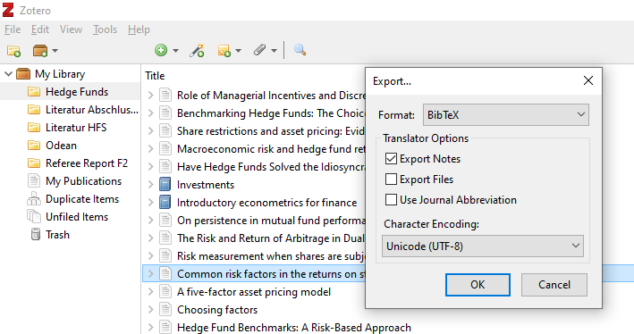
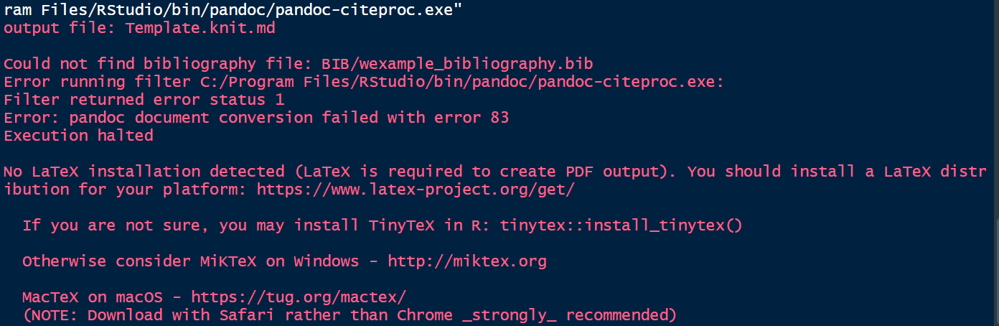

---
# Required Information --------------------------------------------------------
# change lines 4 - 18
title: "Thesis Title"
author1: "Max Mustermann"
adress_street_and_no1: "Königsworther Platz 1"
postcode1: "30167"
place1: "Hannover"
matriculation_number1: "1234567"
semester1: "1"
course_of_study1: "Wirtschaftswissenschaft"

# if you write in a team, put the data of the second author here:
author2: "Melissa Musterfrau"
adress_street_and_no2: "Königsworther Platz 2"
postcode2: "30167"
place2: "Hannover"
matriculation_number2: "7654321"
semester2: "2"
course_of_study2: "Wirtschaftswissenschaft"

# if you write in a team, put the data of the third author here:
author3: "Maxi Musterperson"
adress_street_and_no3: "Königsworther Platz 3"
postcode3: "30167"
place3: "Hannover"
matriculation_number3: "1235813"
semester3: "3"
course_of_study3: "Wirtschaftswissenschaft"

date: "31.03.2020"

university: "Leibniz Universität Hannover"
faculty: "Wirtschaftswissenschaftliche Fakultät" 
institute: "Institut für Banken und Finanzierung"
advisor: "Prof. Dr. Maik Dierkes"
altadvisor: "Supervisor"            
module: "Title of the Lecture/Seminar"
# Belegnummer:
module_number: "123465"
#Change to "de" for German Inhaltsverzeichnis, Tabellenverzeichnis etc. En-us should be used if you write in English
lang: "en-us"
#
output: 
  pdf_document:
    template: ibf_template.tex
    extra_dependencies:
    - dcolumn
    number_sections: true
    toc: true
    toc_depth: 3
    highlight: tango
    keep_tex: false
geometry: "a4paper, left=2cm,right=5cm,top=3cm,bottom=3cm"
bibliography: BIB/example_bibliography.bib
csl: CSL/apa.csl
#Use 11pt instead of 12pt to get the exact same font size as 12pt Times New Roman in Word. Latin Modern is slightly larger for some reason.
fontsize: 11pt
linestretch: 1.5
lof: true
lot: true
---


```{r setup, include=FALSE, warning= FALSE}
knitr::opts_chunk$set(echo = TRUE, message = FALSE)


sharkdata <- "https://raw.githubusercontent.com/allisonhorst/stats-illustrations/master/other-stats-artwork/shark_raw.csv"


library(knitr)


```


# Introduction

This simplified RMarkdown template is designed for students at the Leibniz University Hannover (LUH) to prepare their (seminar) thesis. 
The cover sheet and the statutory declaration (ehrenwörtliche Erklärung) are in compliance with the requirements of the Student Dean's office. 
Margins, font size and citation style are in line with the formal guidelines of the Institute of Banking and Finance and may be adapted to the requirements at other LUH institutes. 


# Language

## Switch from English to German

This template supports theses in German and English. To switch between them, use the `lang` parameter in the yaml header. 
To write in American English (German), use "en-us" ("de"). This affects the name of the table of contents, list of figures, list of tables and the statutory declaration. 
However, this does not change the title of the references, this has to be adapted manually.

## RStudio spell-checking

From RStudio 1.3 upwards, the RStudio IDE offers live spell checking. 
To change it from English to German, go to Tools -> Global Options -> Spelling and change the main dictionary to German. 
Live spelling doesn't work for German (new) just yet, but in most cases, the German dictionary will suffice. 
Make sure to check "use live spell checking" after changing the dictionary. The change will affect the output after you save the document. 
In order to install a full German dictionary for spelling suggestions, follow these steps:

  1. Download the German dictionary files [de_DE_frami.aff](https://cgit.freedesktop.org/libreoffice/dictionaries/tree/de/de_DE_frami.aff) and [de_DE_frami.dic](https://cgit.freedesktop.org/libreoffice/dictionaries/tree/de/de_DE_frami.dic) from the libreoffice repository (free!).
  2. Click [here](https://support.rstudio.com/hc/en-us/articles/200551916-Spelling-Dictionaries) to add them to RStudio by copying them into the correct folder. This depends on your operating system, but the explanation on the website is pretty thorough.
  
  
# Equations


## Inline equations

RMarkdown and LaTex are the perfect combination for theses with math equations. 
In this case, RMarkdown relies on the syntax of LaTeX when typesetting equations, so it is hard to distinguish between the two languages.
To add an equation to the text, simply use $e = mc^2$. 
There are many more expressions, just download the corresponding cheat sheet:

[LaTeX cheat sheet](https://wch.github.io/latexsheet/latexsheet.pdf)


## Block equations

Sometimes, equations are too central to be written in a line of text.
In this case, use block equations.
RMarkdown does this by doing the following:
```
$$ \overline{x} = \frac{1}{N} \sum_{i = 1}{N} x_i $$
```
Once you write it outside a code chunk, RMarkdown is setting the equation for you:

$$ \overline{x} = \frac{1}{N} \sum_{i = 1}{N} x_i $$

This has one major disadvantage, namely that there are no numbers for the equations.
Numbered equations are useful if you want to refer to the equation later on. 

Since the syntax above is 99% LaTeX anyway, just use the native LaTeX equation environment:


```
\begin{equation} 
  \label{equation_arithmetic_mean}
  \overline{x} = \frac{1}{N} \sum_{i = 1}{N} x_i 
\end{equation}
```
The result is the same, but you get a numbered equation:
\begin{equation} 
  \label{equation_arithmetic_mean}
  \overline{x} = \frac{1}{N} \sum_{i = 1}{N} x_i 
\end{equation}


If you want to deactivate enumeration, use equation* within the braces. 
Use the label to refer to this important equation by using `\eqref{label}`.^[`\eqref{label}` directly wraps the equation number with parentheses. 
`\ref{label}` can be used for all kinds of cross-referencing.
This is pure LaTeX, doing this in Markdown would require additional packages.]
Equation \eqref{equation_arithmetic_mean} is the arithmetic mean.
There are other equation environments, e.g. array for more complicated expressions. 


# Figures


## Figures from local files or the internet

Figures and tables are important tools to present results or illustrate important aspects of your thesis.
Just as LaTeX, Word, OpenOffice or Pages, RMarkdown allows you to include figures from files such as .png or .pdf or websites.
The syntax is quite simple, just use

```
{width=100%}

```
The source can be a file on your computer like in the example below, or a web address.

.  ](FIGURES/rmarkdown_rockstar.png){width=75%}


## Figures from R plots

Thanks to the unique combination of R Code and text, you can also directly present R plots and add a caption. Just see this example:

```{r example_figure, fig.cap = "A dangerous animal. Source: [Allison Horst]( https://github.com/allisonhorst/stats-illustrations).", fig.height = 4, fig.width = 6}

data <- read.csv(sharkdata)
plot(data$x, data$y, xlab = "", ylab = "")

```

Rather than using `{width=75%}` to control the size of the figure, just use the chunk options above.
In most cases this is trial and error to get the looks right^[For example, the shark looks far less dangerous (chubby, even), if you use `fig.height = 5` above.], so feel free to change the settings above.
Note that the figure won't necessarily show up right below the chunk in order to manage the space efficiently.

# Tables

## kable

Tables are another important tool to present information.
RMarkdown provides several ways to include tables. 
A simple way to print data frames -- for example a table with summary statistics -- is the `knitr` function `kable` (presumably stands for "knit table"). 


```{r example_table}
example_data <- read.csv("DATA/example_data.csv")
kable(example_data,
      booktabs = TRUE,
      digits = 2,
      caption = "Example Table with kable.") 
```


The option `booktabs = TRUE` uses the LaTeX booktabs package which produces nice tables without vertical lines. 
The option `digits= 2` should be self-explanatory. 
To see more options, visit the documentation for `kable` or use the help function in your R console.


## Markdown tables

Markdown comes with a native syntax to set tables which is different from LaTeX or html, but very simple.
Just to give you an example:

```
| A           |  Simple       | Table |
|-------------|:-------------:|------:|
| First col.  |  left-aligned | More  |
| Second col. |    centered   | data  |
| Third col.  | right-aligned | here  |

Table: Your Caption
```

The `:` indicate the alignment of the table.
This is how it looks like once you write it outside a code chunk:


| A           |  Simple       | Table |
|-------------|:-------------:|------:|
| First col.  |  left-aligned | More  |
| Second col. |    centered   | data  |
| Third col.  | right-aligned | here  |

Table: Example Table in Markdown.


## LaTeX tables

If you are used to LaTeX already, it might be natural to continue using LaTeX syntax for tables. 
RMarkdown supports this. 

```
\begin{table}[]
  \caption{Example Table in LaTex.}
  \begin{tabular}{lcr}
  \toprule
  A           & LaTeX         & Table \\ \midrule
  First col.  & left-aligned  & More  \\
  Second col. & centered      & data  \\
  Third col.  & right-aligned & here 
  \end{tabular}
\end{table}
```
Once you write this outside a chunk, this is how it will turn out:

\begin{table}[!htp]
  \caption{Example Table in LaTex.}
  \begin{center}
  \begin{tabular}{lcr}
  \toprule
  A           & LaTeX         & Table \\ \midrule
  First col.  & left-aligned  & More  \\
  Second col. & centered      & data  \\
  Third col.  & right-aligned & here  \\ \bottomrule
  \end{tabular}
  \end{center}
\end{table}

LaTeX tables come with a nice option called floats. 
By adding `!htp` between the brackets in `\begin{table}[!htp]`, you can tell LaTeX to put the table (h)ere, at the (t)op of the page or on its own (p)age.
Those options will be prioritized in this order.

## Tables generator

Setting the tables manually is quite difficult. 
The website [tablesgenerator.com](https://www.tablesgenerator.com) is a nice interface to paste information into tables and make adjustments such as alignments etc. 
You can choose between LaTeX and Markdown tables, the functionalities of LaTeX are a little more advanced.


# Citations

## Citations in Markdown

For in-text citations, simply use `@bib_key`, where the `bib_key` is the key of your reference in the bibliography (explained below).
For example, `@wickham_r_2016` will produce the following:
@wickham_r_2016 is an outstanding introduction to data science with R.

To cite in parentheses, just wrap the bib-key in squared brackets `[@wickham_r_2016]`. 
You can add multiple entries by separating them with a comma and also write text before and after the reference, for example `[see @wickham_r_2016, p. 109]`.^[Note that LaTeX citation, i.e. `\cite{}` and `\citep{}` are also fully supported.]
The following example illustrates this: 

A three factor model including a size and a value factor improves the explanatory power of the CAPM [see @fama_common_1993, p. 4.].


## Footnotes

Instead of citing in parentheses, we recommend citation in footnotes. 
This is not mandatory, as long as you cite properly and include the pages.
To include a footnote, just write `^[Content of the footnote]` and add the citation without the parentheses in the footnote, e.g.: `^[See @fama_common_1993, p. 4.]`. 
In your thesis, this should look as follows:

A three factor model including a size and a value factor improves the explanatory power of the CAPM.^[See @fama_common_1993, p. 4]


## Generating a bib-file and bib-keys

In this example, the references are in the example file for the bibliography which come with the template. 
Once you start working on your thesis, you have to add your own literature to the bibliography, this requires a certain syntax.
Instead of creating the bib-file manually, I recommend a reference manager.
The easiest options are Zotero and Jabref. 
I recommend Zotero, because future RStudio releases will support Zotero directly (unfortunately, we're not there yet). 

To organize your library in Zotero, you can drag and drop pdf files or add new entries with common indicators such as ISBN or DOI. 
Once you gathered all the literature, just highlight the references, click right -> Export Items to get to the following menu:

{width=100%}

Then select "BibTex" to save the .bib file in the folder BIB. 
Just adapt the `bibliography: BIB/example_bibliography.bib` statement in the header to use your file and you're done.

One important drawback is that you have to use the key instead of the full title. 
Zotero creates bib-keys in the following way:

1. First author (last name)
2. First word of the title
3. Year of the reference.

Each element is separated with `_`. Just look up  `@fama_common_1993` in the bibliography below to see that.
For now, it is straightforward to have the bib-file open in a text editor and copy the entries manually. 
A direct support in RStudio is on the way.
**Note: Make sure to maintain the references in Zotero (reference type, authors etc.) to export them correctly to the bib-file.**


# Debugging

## Debugging R Code

While the advantages of this template are obvious (looks great, conventient support of equations, tables and figures), programming is prone to errors which won't happen if you work with WYSIWYG software (e.g. Word). 
Even worse, the combination of R Code and text in this document has two sources of error, that is the R Code itself and the typesetting RMarkdown/LaTeX. 

  ](FIGURES/debugging.jpg)

When you want to knit the document, these two sources of error can be annoying.
First, it is reasonable to rule out R errors. 
To do this, run each chunk separately by clicking on the `play` button on the top right or press Ctrl+Shift+Enter in the chunk. 
The output below will tell you if the chunk runs smoothly.
Make sure to eradicate all potential R errors this way.^[A common error which won't show up this way happens if you have a pipe `%>%` at the end of a code chunk.]
**Either way, make sure to tread the error message closely, pasting the error text to Google is usually helpful.**

## Debugging LaTeX issues

Unfortunately, the error messages for LaTeX errors are not always straightforward, users typically separate informative from non-informative errors. 
In most cases, the errors are helpful, for example:



"Could not find bibliography file: BIB/wexample_bibliography.bib" means that there is probably something wrong with the bib-file I provided, there is obviously a typo.
Unfortunately, RMarkdown **almost always** tells you that you have no LaTeX installation. 
This is not true if you followed the instructions before downloading this template.

# Additional LaTeX features

Some experienced LaTeX users might feel that the basic functions of this template are insufficient.
To add packages, just add them to the extra dependencies in the header in the following way:

```
extra_dependencies:
    - dcolumn
    - newpackage1
    - newpackage2
```


# How to get started

Now to get started and put this template to use, just save it in your working directory, get rid of all the stuff above and start with your thesis.
This document is work in progress, so if you encounter any unsolvable issues, write an e-mail to [Sebastian Schrön](mailto:sebastian.schroen@finance.uni-hannover.de)

\newpage
\appendix

# Appendix

If your thesis needs an appendix, simply use `\appendix` to separate the main body of your thesis from the appendix. 
The sections will have alphabetic enumeration instead of Arabic numbers to indicate appendices.
Ideally, use `\newpage` to start the appendix on a new page.


\newpage

# Literature